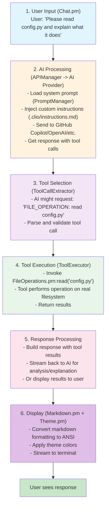
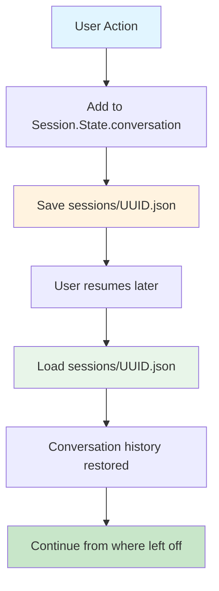
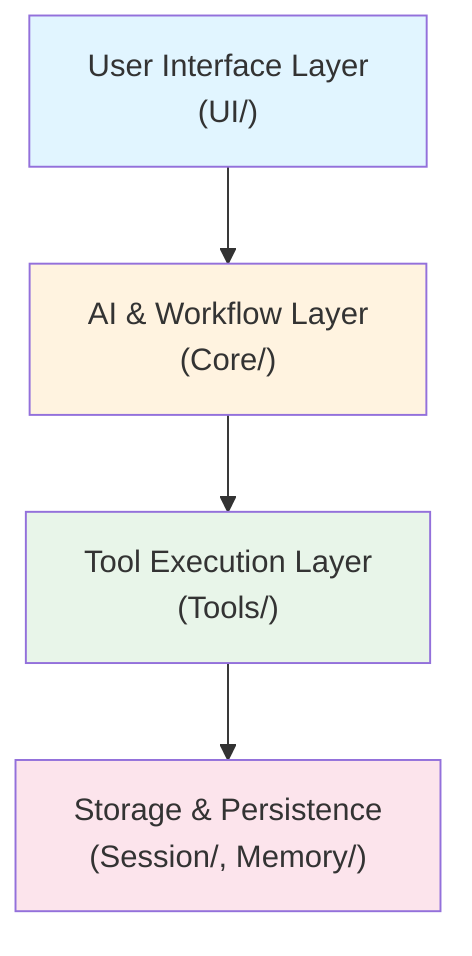

# CLIO Architecture

**Last Updated:** March 2026

---------------------------------------------------

## Quick Overview

CLIO is a **terminal-first AI code assistant** built in Perl. It integrates AI models (GitHub Copilot, OpenAI, etc.) with local tools (file operations, git, terminal) to help developers work more effectively.

**Core concept:** User types → CLIO thinks → CLIO uses tools → Results displayed

```
User Input
   ↓
Terminal UI (Chat.pm)
   ↓
AI Agent (WorkflowOrchestrator.pm)
   ↓
Tool Selection & Execution
     - File Operations (FileOperations.pm)
     - Git (VersionControl.pm)
     - Terminal (TerminalOperations.pm)
     - Memory (MemoryOperations.pm)
     - Other tools...
   ↓
Response Processing
   ↓
Markdown Rendering (Markdown.pm)
   ↓
Terminal Output
```

---------------------------------------------------

## System Components

### 1. User Interface Layer
**Files:** `lib/CLIO/UI/`

| Component | File | Purpose |
|-----------------------------------------------------------------------------------------------------------------------------------------------------------|------------------------------------------------------------------------------------------------------|---------------------------------------------------------------------------------------------------------------------------------------------------------|
| Terminal UI | `Chat.pm` | Main interaction loop, streaming output |
| Markdown Renderer | `Markdown.pm` | Convert markdown to ANSI |
| Color/ANSI | `ANSI.pm` | ANSI escape sequences |
| Themes | `Theme.pm` | Color themes and styling |
| Display | `Display.pm` | Display utilities (writeline, colors) |
| Tool Output Formatter | `ToolOutputFormatter.pm` | Format tool operation output |
| Command Handler | `CommandHandler.pm` | Route slash commands to handler modules |
| Progress Spinner | `ProgressSpinner.pm` | Animated busy indicator |
| Multiplexer | `Multiplexer.pm` | Terminal multiplexer detection and pane management |
| Commands Base | `Commands/Base.pm` | Base class providing display delegation for all slash command modules |

**How it works:**
1. User types message
2. Chat.pm sends to AI
3. Stream responses back to terminal
4. Markdown rendering converts formatting
5. Apply theme colors

### 2. Core AI & Workflow
**Files:** `lib/CLIO/Core/`

| Component | File | Purpose |
|-----------------------------------------------------------------------------------------------------------------------------------------------------------|------------------------------------------------------------------------------------------------------|---------------------------------------------------------------------------------------------------------------------------------------------------------|
| API Manager | `APIManager.pm` | AI provider integration, token management |
| Workflow Orchestrator | `WorkflowOrchestrator.pm` | Main agent loop, tool orchestration |
| Simple AI Agent | `SimpleAIAgent.pm` | Lightweight AI agent for internal tasks |
| Tool Executor | `ToolExecutor.pm` | Invokes tools, applies secret redaction |
| Tool Call Extractor | `ToolCallExtractor.pm` | Extract tool calls from AI responses |
| Prompt Manager | `PromptManager.pm` | System prompts + custom instructions |
| Prompt Builder | `PromptBuilder.pm` | Prompt construction utilities |
| Instructions Reader | `InstructionsReader.pm` | Reads `.clio/instructions.md` and `AGENTS.md` |
| Config | `Config.pm` | API keys, provider selection, model aliases |
| ReadLine | `ReadLine.pm` | Command history & editing |
| Command Parser | `CommandParser.pm` | Parse user commands |
| Editor | `Editor.pm` | Core editing functionality |
| Hashtag Parser | `HashtagParser.pm` | Parse hashtag commands |
| Tab Completion | `TabCompletion.pm` | Tab completion support |
| Skill Manager | `SkillManager.pm` | Manage AI skills |
| Copilot User API | `CopilotUserAPI.pm` | GitHub Copilot user management |
| Device Registry | `DeviceRegistry.pm` | Named devices and groups for remote execution |
| Agent Loop | `AgentLoop.pm` | Persistent agent execution loop |
| Conversation Manager | `ConversationManager.pm` | Conversation history management |
| Model Registry | `ModelRegistry.pm` | AI model metadata and management |
| Tool Error Guidance | `ToolErrorGuidance.pm` | Contextual error recovery hints |
| Error Context | `ErrorContext.pm` | Error taxonomy and structured error context |
| Message Validator | `API/MessageValidator.pm` | Validate and proactively trim messages for AI providers |
| Response Handler | `API/ResponseHandler.pm` | Parse and process AI provider responses |
| GitHub Auth | `GitHubAuth.pm` | GitHub OAuth authentication |
| GitHub Copilot Models API | `GitHubCopilotModelsAPI.pm` | Access GitHub Copilot models |
| Performance Monitor | `PerformanceMonitor.pm` | Track timing metrics |
| Logger | `Logger.pm` | Debug and trace output |

**How it works:**
1. APIManager connects to AI provider (GitHub Copilot, OpenAI, etc.)
2. WorkflowOrchestrator manages complex interactions
3. PromptManager provides system prompt + custom instructions
4. ToolExecutor invokes selected tools
5. Results processed and returned

### 3. Tool System
**Files:** `lib/CLIO/Tools/`

| Tool | File | Operations |
|------------------------------------------------------------------------------------------------------|------------------------------------------------------------------------------------------------------|------------------------------------------------------------------------------------------------------------------------------------------------------------------------------------------------------------|
| File Operations | `FileOperations.pm` | read, write, search, create, delete, rename, etc. |
| Version Control | `VersionControl.pm` | git status, log, diff, commit, branch, push, pull |
| Terminal | `TerminalOperations.pm` | exec - run shell commands |
| Memory | `MemoryOperations.pm` | store, retrieve, search, list, delete |
| Todo | `TodoList.pm` | create, update, complete, list, track tasks |
| Code Intelligence | `CodeIntelligence.pm` | list_usages, search_history |
| Web | `WebOperations.pm` | fetch_url, search_web |
| User Collaboration | `UserCollaboration.pm` | request_input - checkpoint prompts |
| Sub-Agent Operations | `SubAgentOperations.pm` | Spawn and manage parallel agents |
| Remote Execution | `RemoteExecution.pm` | Execute AI tasks on remote systems |
| Apply Patch | `ApplyPatch.pm` | Apply lightweight diff patches |
| MCP Bridge | `MCPBridge.pm` | Bridge to MCP tool servers |
| Base Tool | `Tool.pm` | Abstract base class for all tools |
| Registry | `Registry.pm` | Tool registration and lookup |

**Architecture:**
- Base class: `Tool.pm` provides abstract interface
- Each tool extends Tool.pm and implements execute()
- `Registry.pm` maintains tool registry and handles lookup
- `ToolExecutor.pm` (in Core) invokes tools and manages execution
- `ToolResultStore.pm` (in Session) caches large tool outputs for efficiency

### 4. Session Management
**Files:** `lib/CLIO/Session/`

| Component | File | Purpose |
|-----------------------------------------------------------------------------------------------------------------------------------------------------------|------------------------------------------------------------------------------------------------------|---------------------------------------------------------------------------------------------------------------------------------------------------------|
| Session Manager | `Manager.pm` | Create/load/resume sessions |
| Session State | `State.pm` | Conversation history, metadata |
| Todo Store | `TodoStore.pm` | Persist todos across sessions |
| Tool Result Store | `ToolResultStore.pm` | Cache tool results for large output |
| File Vault | `FileVault.pm` | Targeted file backup for undo/revert |
| Session Export | `Export.pm` | Export sessions to self-contained HTML |
| Session Lock | `Lock.pm` | Lock files to prevent concurrent access |

**How it works:**
1. New session: Create `sessions/UUID.json`
2. Each message appended to conversation history
3. Sessions persist on disk (in `sessions/` directory)
4. Resume: Load session from disk, continue conversation

### 5. Memory System
**Files:** `lib/CLIO/Memory/`

| Component | File | Purpose |
|-----------------------------------------------------------------------------------------------------------------------------------------------------------|------------------------------------------------------------------------------------------------------|---------------------------------------------------------------------------------------------------------------------------------------------------------|
| Short-Term | `ShortTerm.pm` | Session context |
| Long-Term | `LongTerm.pm` | Persistent storage |
| YaRN | `YaRN.pm` | Conversation threading |
| Token Estimator | `TokenEstimator.pm` | Count tokens for context |

**How it works:**
- Short-term memory maintains current session context
- Long-term memory provides persistent storage across sessions
- YaRN manages conversation threading and context windows
- Token estimator prevents context overflow

### 5b. User Profile
**Files:** `lib/CLIO/Profile/`

| Component | File | Purpose |
|-----------|------|---------|
| Analyzer | `Analyzer.pm` | Scan session history for personality patterns |
| Manager | `Manager.pm` | Load/save/inject profile into prompts |

**How it works:**
- Profile stored at `~/.clio/profile.md` (global, never in git)
- Analyzer scans `.clio/sessions/` across sibling projects
- Manager injects profile into system prompt via PromptBuilder
- `/profile build` triggers analysis + AI-assisted collaborative refinement

### 6. Code Analysis
**Files:** `lib/CLIO/Code/`

| Component | File | Purpose |
|-----------------------------------------------------------------------------------------------------------------------------------------------------------|------------------------------------------------------------------------------------------------------|---------------------------------------------------------------------------------------------------------------------------------------------------------|
| Tree-sitter | `TreeSitter.pm` | Parse code into AST |
| Symbols | `Symbols.pm` | Extract function/class names |
| Relations | `Relations.pm` | Map symbol relationships |

**How it works:**
- TreeSitter parses source code into abstract syntax trees
- Symbols extracts function/class/variable definitions
- Relations maps dependencies and call graphs

### 7. Security
**Files:** `lib/CLIO/Security/`

| Component | File | Purpose |
|-----------------------------------------------------------------------------------------------------------------------------------------------------------|------------------------------------------------------------------------------------------------------|---------------------------------------------------------------------------------------------------------------------------------------------------------|
| Auth | `Auth.pm` | GitHub OAuth, token storage |
| Authz | `Authz.pm` | Check file access permissions |
| Path Authorizer | `PathAuthorizer.pm` | Control file access |
| Secret Redactor | `SecretRedactor.pm` | PII and secret redaction from tool output |
| Manager | `Manager.pm` | Security management and coordination |
| Invisible Char Filter | `InvisibleCharFilter.pm` | Detect and strip invisible Unicode characters from user input |

**How it works:**
1. User runs `/api login` → GitHub device flow
2. Token stored securely in `~/.clio/`
3. File operations check PathAuthorizer
4. Tool output passes through SecretRedactor before display/AI transmission
5. Audit logging of all operations

### 8. Logging & Monitoring
**Files:** `lib/CLIO/Logging/`, `lib/CLIO/Core/`

| Component | File | Purpose |
|-----------------------------------------------------------------------------------------------------------------------------------------------------------|------------------------------------------------------------------------------------------------------|---------------------------------------------------------------------------------------------------------------------------------------------------------|
| Logger | `Core/Logger.pm` | Debug/trace output |
| Tool Logger | `Logging/ToolLogger.pm` | Log tool operations |
| Performance Monitor | `Core/PerformanceMonitor.pm` | Track timing |
| Process Stats | `Logging/ProcessStats.pm` | RSS/VSZ memory and resource tracking |

---------------------------------------------------

### 15. Utilities
**Files:** `lib/CLIO/Util/`

| Component | File | Purpose |
|-----------|------|---------|
| Path Resolver | `PathResolver.pm` | Tilde expansion, path canonicalization |
| Text Sanitizer | `TextSanitizer.pm` | Sanitize text for safe display |
| JSON | `JSON.pm` | Opportunistic fast JSON (JSON::XS > Cpanel::JSON::XS > JSON::PP) |
| JSON Repair | `JSONRepair.pm` | Repair malformed JSON from AI responses |
| Git Ignore | `GitIgnore.pm` | Auto-manage `.clio/` entries in `.gitignore` |
| Input Helpers | `InputHelpers.pm` | Terminal input utilities |
| Anthropic XML Parser | `AnthropicXMLParser.pm` | Parse Anthropic tool call XML format |
| YAML | `YAML.pm` | Lightweight YAML parser (no CPAN required) |

**How it works:**
- Debug mode: `clio --debug`
- Output goes to STDERR with `[DEBUG]`, `[ERROR]`, `[TRACE]` prefixes
- Tool operations logged via ToolLogger

### 9. Protocol System
**Files:** `lib/CLIO/Protocols/`

| Protocol | File | Purpose |
|----------------------------------------------------------------------------------------------------------------------------------------------------------|------------------------------------------------------------------------------------------------------|---------------------------------------------------------------------------------------------------------------------------------------------------------|
| Architect | `Architect.pm` | Problem-solving design |
| Editor | `Editor.pm` | Code modification format |
| Validate | `Validate.pm` | Code validation |
| RepoMap | `RepoMap.pm` | Repository mapping |
| Recall | `Recall.pm` | Memory recall |
| Handler | `Handler.pm` | Protocol base class |
| Manager | `Manager.pm` | Protocol registry |

**How it works:**
1. AI returns natural language protocol commands
2. Protocol handlers are invoked directly by the AI agent
3. Manager looks up protocol handler
4. Handler executes the protocol
5. Results sent back to AI

### 10. Multi-Agent Coordination
**Files:** `lib/CLIO/Coordination/`

| Component | File | Purpose |
|-----------------------------------------------------------------------------------------------------------------------------------------------------------|------------------------------------------------------------------------------------------------------|---------------------------------------------------------------------------------------------------------------------------------------------------------|
| Broker | `Broker.pm` | Unix socket coordination server for agent communication |
| Client | `Client.pm` | Broker connection API |
| SubAgent | `SubAgent.pm` | Process spawning and lifecycle management |

**How it works:**
1. Main session spawns sub-agents as separate processes
2. Broker provides coordination via Unix socket (file locks, git locks, message bus)
3. Agents communicate through the broker (questions, status updates, completions)
4. API rate limiting is shared across all agents

### 11. Terminal Multiplexer Integration
**Files:** `lib/CLIO/UI/Multiplexer.pm`, `lib/CLIO/UI/Multiplexer/`

| Component | File | Purpose |
|-----------|------|---------|
| Multiplexer | `Multiplexer.pm` | Detection, driver abstraction, pane lifecycle management |
| Tmux Driver | `Multiplexer/Tmux.pm` | tmux pane operations via CLI (split-window, kill-pane) |
| Screen Driver | `Multiplexer/Screen.pm` | GNU Screen window operations via CLI (-X commands) |
| Zellij Driver | `Multiplexer/Zellij.pm` | Zellij pane operations via action commands |
| Mux Commands | `Commands/Mux.pm` | `/mux` slash commands (status, agent, close, auto) |

**How it works:**
1. On initialization, detects multiplexer via environment variables (`$TMUX`, `$STY`, `$ZELLIJ`)
2. Detection priority: tmux > GNU Screen > Zellij
3. When `/agent spawn` is called inside a multiplexer, auto-opens a pane with `tail -f` of the agent's log
4. All operations are graceful no-ops when no multiplexer is detected
5. Each driver translates CLIO's pane API to multiplexer-specific CLI commands
6. Managed panes are tracked and can be listed/closed via `/mux` commands

### 12. AI Providers
**Files:** `lib/CLIO/Providers/`

| Component | File | Purpose |
|-----------------------------------------------------------------------------------------------------------------------------------------------------------|------------------------------------------------------------------------------------------------------|---------------------------------------------------------------------------------------------------------------------------------------------------------|
| Provider Registry | `Providers.pm` | AI provider registration and lookup |
| Base | `Base.pm` | Abstract base class for providers |
| Anthropic | `Anthropic.pm` | Native Anthropic API (Claude) |
| Google | `Google.pm` | Native Google Gemini API |

**How it works:**
- Base.pm defines the provider interface
- Each provider implements native API communication
- Providers register via Providers.pm for runtime selection
- GitHub Copilot and OpenAI-compatible providers are handled directly by APIManager

### 13. OpenSpec Integration
**Files:** `lib/CLIO/Spec/`, `lib/CLIO/Util/YAML.pm`, `lib/CLIO/UI/Commands/Spec.pm`

| Component | File | Purpose |
|-----------|------|---------|
| Spec Manager | `Spec/Manager.pm` | Spec and change lifecycle management |
| YAML Parser | `Util/YAML.pm` | Lightweight YAML parser for OpenSpec config/schema files |
| Spec Commands | `UI/Commands/Spec.pm` | `/spec` slash command handler |

**How it works:**
1. User runs `/spec init` to create `openspec/` directory structure
2. `/spec propose <name>` creates a change and sends structured prompt to AI
3. AI generates planning artifacts (proposal, specs, design, tasks) via file_operations
4. User implements against tasks.md using normal CLIO workflow
5. `/spec archive` moves completed change to archive
6. PromptManager auto-injects spec context into system prompt when `openspec/` exists
7. File format is 100% compatible with the OpenSpec Node.js CLI

---------------------------------------------------

## Data Flow

### Typical Interaction



### Session Persistence



---------------------------------------------------

## Entry Points

### `clio` Script (Main Executable)
```perl
#!/usr/bin/env perl
1. Load required modules
2. Parse command-line arguments (--new, --resume, --debug, etc.)
3. Initialize configuration
4. Create/load session
5. Instantiate Chat.pm UI
6. Start interactive loop
```

### `clio --new`
- Start fresh session
- Create new `sessions/UUID.json`
- Begin conversation

### `clio --resume`
- Find most recent session
- Load conversation history
- Resume from where left off

### `clio --input "text" --exit`
- Non-interactive mode
- Process input and exit immediately
- Used for scripting/automation

---------------------------------------------------

## Configuration

### Locations
- **API Keys:** `~/.clio/config.json`
- **Sessions:** `./sessions/` (project directory)
- **Custom Instructions:** `./.clio/instructions.md` (project directory)
- **System Prompts:** `~/.clio/system-prompts/` (user home)

### Setup Process
```bash
clio --new           # First run
: /api login        # Authorize with GitHub Copilot
: /config show      # View config
: /api provider     # Check current provider
```

---------------------------------------------------

## Dependencies

### Required (Perl Core Only)
- `strict`, `warnings` (language features)
- `JSON::PP` (JSON parsing, core since 5.14)
- `HTTP::Tiny` (HTTP requests, core since 5.14)
- `MIME::Base64` (base64 encoding, core since 5.8)
- `Digest::SHA` (SHA hashing, core since 5.10)
- `File::Spec` (cross-platform paths, core)
- `File::Path` (directory operations, core)
- `File::Temp` (temporary files, core)
- `File::Find` (file tree traversal, core)
- `File::Basename` (path manipulation, core)
- `Time::HiRes` (high-resolution timers, core since 5.8)
- `POSIX` (POSIX functions, core)
- `Cwd` (working directory, core)
- Plus other core modules

### Optional (Non-Core, Graceful Degradation)
- `Text::Diff` (diff visualization - has fallback if not installed)

### External Tools Required
- System `git` (for version control operations)
- System `perl` 5.32+ (for script execution)

### NOT Used
- ❌ CPAN modules (except optional Text::Diff with fallback)
- ❌ External npm/pip packages  
- ❌ Build tools like Make or Gradle
- ❌ Term::ReadLine (not required, uses basic readline if missing)

---------------------------------------------------

## Testing

### Test Framework
- `lib/CLIO/Test/Framework.pm` - Test utilities
- `tests/run_all_tests.pl` - Test runner
- `tests/**/*.t` - Individual test files

### Current Coverage
- ✅ Encoding tests: 171/171 PASS
- ✅ CLI tests: 9/9 PASS
- ⚠️ Tool operations: Basic coverage
- ⚠️ Integration: Spot checks only

### Run Tests
```bash
./tests/run_all_tests.pl --all
```

---------------------------------------------------

## Performance Considerations

### Speed
- Direct tool invocation (no remote API for file ops)
- Streaming responses from AI (no wait for full response)
- Token counting for efficient context usage

### Memory
- Session data in `sessions/` (JSON files)
- In-memory conversation history
- Token estimator helps avoid OOM

### Scalability
- Not designed for 1000s of projects
- Designed for individual developer workflows
- Can handle large codebases (>1GB)

---------------------------------------------------

## Architectural Considerations

### Design Principles
1. **Modularity** - Each component has a single, well-defined responsibility
2. **Extensibility** - Tools and protocols can be added without modifying core
3. **Separation of Concerns** - UI, AI, tools, and storage are independent layers
4. **Graceful Degradation** - Optional features fail safely (e.g., Text::Diff)

### Extension Points
- **Tools**: Create new tool in `lib/CLIO/Tools/`, register in Registry
- **Protocols**: Create protocol handler in `lib/CLIO/Protocols/`, extend Handler.pm
- **UI Themes**: Add theme file in `themes/`, define color scheme
- **AI Providers**: Add provider logic in Core/APIManager.pm

---------------------------------------------------

## Module Organization

```
lib/CLIO/
  Providers.pm             # AI provider registry (SAM, GitHub Copilot, etc.)
  Update.pm                # Self-update system
  UI/                      # Terminal interface
      Chat.pm              # Main interactive loop
      Markdown.pm          # Markdown to ANSI
      ANSI.pm              # Color codes
      Theme.pm             # Color themes
      Display.pm           # Display utilities
      ToolOutputFormatter.pm # Tool output formatting
      CommandHandler.pm    # Slash command routing
      ProgressSpinner.pm   # Progress indicators
      Commands/            # Slash command handlers
          Base.pm          # Base class with display delegation for all command modules
          AI.pm            # AI-powered commands (/explain, /review, /doc)
          API.pm           # API/provider commands (/api, /model)
          Billing.pm       # Billing/usage commands (/billing, /usage)
          Config.pm        # Configuration commands (/config, /theme)
          Context.pm       # Context window commands (/context)
          Device.pm        # Device management commands (/device)
          File.pm          # File commands (/file, /read, /edit)
          Git.pm           # Git commands (/git, /status, /diff)
          Log.pm           # Log commands (/log)
          Memory.pm        # Memory commands (/memory)
          Mux.pm           # Multiplexer commands (/mux)
          Profile.pm       # User profile commands (/profile)
          Project.pm       # Project setup commands (/design, /init)
          Prompt.pm        # Prompt commands (/prompt)
          Session.pm       # Session management commands (/session)
          Skills.pm        # Skill system commands (/skill)
          Spec.pm          # OpenSpec commands (/spec)
          Stats.pm         # Stats commands (/stats)
          SubAgent.pm      # Sub-agent commands (/subagent)
          System.pm        # System commands (/clear, /exit, /shell)
          Todo.pm          # Todo commands (/todo)
          Update.pm        # Update commands (/update)
      Multiplexer.pm       # Terminal multiplexer detection and abstraction
      Multiplexer/         # Multiplexer drivers
          Tmux.pm          # tmux driver
          Screen.pm        # GNU Screen driver
          Zellij.pm        # Zellij driver
  Core/                    # Core AI functionality
      APIManager.pm        # AI provider integration
      SimpleAIAgent.pm     # AI request/response
      PromptManager.pm     # System prompts
      PromptBuilder.pm     # Prompt construction
      InstructionsReader.pm # Custom instructions
      WorkflowOrchestrator.pm # Multi-step workflows
      ToolExecutor.pm      # Tool invocation
      ToolCallExtractor.pm # Extract tool calls
      ToolErrorGuidance.pm # Tool error assistance
      ConversationManager.pm # Conversation management
      Config.pm            # Configuration
      ModelRegistry.pm     # Model management
      ReadLine.pm          # Command history
      CommandParser.pm     # Command parsing
      Editor.pm            # Core editing
      HashtagParser.pm     # Hashtag commands
      TabCompletion.pm     # Tab completion
      SkillManager.pm      # AI skills
      GitHubAuth.pm        # OAuth
      GitHubCopilotModelsAPI.pm # Copilot models
      CopilotUserAPI.pm    # Copilot user API
      DeviceRegistry.pm    # Device management
      AgentLoop.pm         # Persistent agent loop
      PerformanceMonitor.pm # Performance tracking
      Logger.pm            # Logging
      API/                 # API sub-modules
          MessageValidator.pm # Message format validation and proactive trimming
          ResponseHandler.pm  # AI provider response parsing
      ErrorContext.pm      # Error taxonomy and structured context
  Tools/                   # Tool implementations
      Tool.pm              # Base class
      Registry.pm          # Tool registry
      FileOperations.pm    # File I/O (17 operations)
      VersionControl.pm    # Git (10 operations)
      TerminalOperations.pm # Shell execution
      MemoryOperations.pm  # Memory operations
      TodoList.pm          # Todo tracking
      CodeIntelligence.pm  # Code analysis
      UserCollaboration.pm # User checkpoints
      SubAgentOperations.pm # Multi-agent management
      RemoteExecution.pm   # Remote SSH execution
      ApplyPatch.pm        # Patch application
      MCPBridge.pm         # MCP tool bridge
      WebOperations.pm     # Web operations
  Session/                 # Session management
      Manager.pm           # Session CRUD
      State.pm             # Conversation state
      TodoStore.pm         # Todo persistence
      ToolResultStore.pm   # Large result storage
      FileVault.pm         # Targeted file backup for undo
      Export.pm            # Session export
      Lock.pm              # Session locking
  Memory/                  # Memory systems
      ShortTerm.pm         # Session context
      LongTerm.pm          # Persistent storage
      YaRN.pm              # Context windowing
      TokenEstimator.pm    # Token counting
  Code/                    # Code analysis
      TreeSitter.pm        # AST parsing
      Symbols.pm           # Symbol extraction
      Relations.pm         # Symbol relationships
  Coordination/            # Multi-agent coordination
      Broker.pm            # Coordination server
      Client.pm            # Broker connection API
      SubAgent.pm          # Process spawning
  Protocols/               # Protocol handlers
      Manager.pm           # Protocol registry
      Handler.pm           # Base class
      Architect.pm         # Design protocol
      Editor.pm            # Code editing protocol
      Validate.pm          # Validation protocol
      RepoMap.pm           # Repository mapping
      Recall.pm            # Memory recall
  Providers/               # Native API provider modules
      Base.pm              # Provider base class
      Anthropic.pm         # Anthropic native API
      Google.pm            # Google Gemini native API
  MCP/                     # Model Context Protocol
      Manager.pm           # MCP server management
      Client.pm            # MCP JSON-RPC client
      Auth/OAuth.pm        # MCP OAuth support
      Transport/Stdio.pm   # Stdio transport
      Transport/HTTP.pm    # HTTP/SSE transport
  Security/                # Security & auth
      Auth.pm              # OAuth
      Authz.pm             # Authorization
      PathAuthorizer.pm    # File access control
      SecretRedactor.pm    # PII/secret redaction
      Manager.pm           # Security manager
      InvisibleCharFilter.pm # Invisible Unicode character defense
  Logging/                 # Logging system
      ToolLogger.pm        # Tool operation logging
      ProcessStats.pm      # Process statistics
  Compat/                  # Compatibility layers
      HTTP.pm              # HTTP compatibility
      Terminal.pm          # Terminal compatibility
  Util/                    # Utilities
      PathResolver.pm      # Path resolution
      TextSanitizer.pm     # Text sanitization
      JSONRepair.pm        # JSON repair
      JSON.pm              # JSON module selection
      ConfigPath.pm        # Config path resolution
      InputHelpers.pm      # Input helpers
      AnthropicXMLParser.pm # Anthropic XML parsing
      YAML.pm              # Lightweight YAML parser (OpenSpec support)
      GitIgnore.pm         # Auto-manage .clio/ entries in .gitignore
  Spec/                    # OpenSpec integration
      Manager.pm           # Spec lifecycle management
  Test/                    # Testing utilities
      MockAPI.pm           # Mock API for tests
  Profile/                 # User personality profile
      Analyzer.pm          # Session history analysis
      Manager.pm           # Profile storage and injection
  Util/                    # Utility modules
      PathResolver.pm      # Path resolution
      TextSanitizer.pm     # Text sanitization
      ... (other utilities)
  NaturalLanguage/         # NL processing
      ... (NL modules)
  Compat/                  # Compatibility layer
      ... (compatibility modules)
```

---------------------------------------------------

## For Developers

### Getting Started
1. **Read:** `docs/CUSTOM_INSTRUCTIONS.md` - How projects customize CLIO
2. **Read:** `docs/DEVELOPER_GUIDE.md` - Development guide and conventions
3. **Explore:** Individual module POD docs

### Understanding Code
- Start with `clio` script entry point
- Follow to `Chat.pm` for UI loop
- Check `WorkflowOrchestrator.pm` for main agent loop and tool orchestration
- See `SimpleAIAgent.pm` for the lightweight internal agent used in session naming and internal tasks
- See `ToolExecutor.pm` for tool invocation

### Adding Features
1. Implement in appropriate module
2. Add tests in `tests/`
3. Run `perl -I./lib -c` on all changed modules
4. Test with `./clio --debug --input "test" --exit`
5. Update relevant docs

### Common Tasks
- **Fix bug:** Find module → Read code → Fix → Test → Commit
- **Add tool:** Create `lib/CLIO/Tools/MyTool.pm` → Register in main script
- **Add protocol:** Create `lib/CLIO/Protocols/MyProtocol.pm` → Register in Manager
- **Update UI:** Modify `lib/CLIO/UI/Chat.pm` or `Theme.pm`

---------------------------------------------------

## Summary

CLIO follows a **layered architecture** with clear separation of concerns:

**Key Architectural Features:**
- **Plugin-based tool system** - Tools register dynamically
- **Protocol-driven AI interaction** - Structured AI communication
- **Persistent session state** - Conversation history survives restarts
- **Zero external dependencies** - Runs with Perl core modules only
- **Modular design** - Each component can evolve independently

The architecture prioritizes **clarity, maintainability, and extensibility** - making it straightforward for developers to understand the codebase and add new capabilities.
