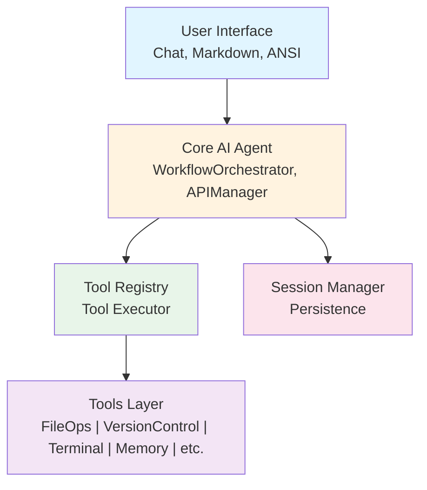

# CLIO Developer Guide

**Complete guide to extending and contributing to CLIO**

---------------------------------------------------

## Table of Contents

1. [Introduction](#introduction)
2. [Architecture Overview](#architecture-overview)
3. [Code Organization](#code-organization)
4. [Development Setup](#development-setup)
5. [Adding New Tools](#adding-new-tools)
6. [Adding New Protocols](#adding-new-protocols)
7. [Adding New AI Providers](#adding-new-ai-providers)
8. [Testing](#testing)
9. [Code Standards](#code-standards)
10. [Contribution Workflow](#contribution-workflow)

---------------------------------------------------

## Introduction

### Welcome!

CLIO is built with extensibility in mind. Whether you want to add new tools, integrate additional AI providers, or enhance existing features, this guide will help you contribute effectively.

### Prerequisites

Before contributing, you should be familiar with:

- **Perl**: Object-oriented Perl, modules, references
- **Terminal UI**: ANSI escape codes, terminal interaction
- **AI APIs**: REST APIs, JSON, streaming responses
- **Git**: Branching, commits, pull requests

### Development Philosophy

CLIO follows these principles:

1. **No CPAN Dependencies**: Use core Perl modules only
2. **Tool-Powered**: AI interacts through well-defined tools
3. **Action Transparency**: Every operation shows what it's doing
4. **Session Persistence**: State survives across restarts
5. **Professional UX**: Terminal UI should be polished and usable

---------------------------------------------------

## Architecture Overview

### High-Level Design



### Core Components

**1. WorkflowOrchestrator** (`lib/CLIO/Core/WorkflowOrchestrator.pm`)
- Main agent loop for interactive and non-interactive operation
- Orchestrates the full turn cycle: message building, API calls, tool execution
- Handles proactive context trimming before each API call
- Manages streaming responses and keypress interrupt detection

**2. APIManager** (`lib/CLIO/Core/APIManager.pm`)
- Abstracts AI provider APIs
- Handles authentication
- Manages streaming responses
- Error handling and retries

**3. Tool Registry** (`lib/CLIO/Tools/Registry.pm`)
- Registers all available tools
- Routes operations to appropriate tools
- Manages tool definitions for AI

**4. Session Manager** (`lib/CLIO/Session/*.pm`)
- Persists conversation history
- Manages session state
- Handles session resumption

**5. UI Components** (`lib/CLIO/UI/*.pm`)
- Chat: Chat interface and main interactive loop
- Markdown: Markdown rendering
- ANSI: ANSI escape code management
- Theme: Color schemes and templates
- Display: Display utilities
- ToolOutputFormatter: Tool output formatting

### Data Flow

**User Input Flow:**
```
User Input → Chat → WorkflowOrchestrator → APIManager → AI Provider
                                     ↓
                              Tool Selection
                                     ↓
                             Tool Execution
                                     ↓
                            Result Collection
                                     ↓
                          AI Response Generation
                                     ↓
                            Markdown Rendering
                                     ↓
                              User Output
```

**Tool Execution Flow:**
```
AI Request → Tool Registry → Route to Tool → Execute Operation
                                                    ↓
                                              Return Result
                                                    ↓
                                           Action Description
                                                    ↓
                                            Back to AI Agent
```

---------------------------------------------------

## Code Organization

### Directory Structure

```
clio/
  clio                      # Main executable
  install.sh                # Installation script
  check-deps                # Dependency checker
  lib/CLIO/                 # Core library
      Core/                 # Core components
          APIManager.pm     # AI provider integration, token management
          WorkflowOrchestrator.pm  # Main agent loop and tool orchestration
          SimpleAIAgent.pm  # Lightweight AI agent for internal tasks
          ToolExecutor.pm   # Tool invocation and secret redaction
          Config.pm         # Configuration management
          Logger.pm         # Logging utilities
          PromptManager.pm  # System prompt management
          PromptBuilder.pm  # Prompt construction utilities
          InstructionsReader.pm  # Custom instructions reader
          ConversationManager.pm  # Conversation history management
          ModelRegistry.pm  # AI model metadata and management
          ToolCallExtractor.pm  # Extract tool calls from AI responses
          ToolErrorGuidance.pm  # Contextual error recovery hints
          ErrorContext.pm   # Error taxonomy and structured context
          AgentLoop.pm      # Persistent agent execution loop
          DeviceRegistry.pm # Named devices for remote execution
          SkillManager.pm   # AI skill management
          PerformanceMonitor.pm  # Performance tracking
          API/              # API sub-modules
              MessageValidator.pm  # Message validation and proactive trimming
              ResponseHandler.pm   # AI provider response parsing
          ReadLine.pm  Editor.pm
          HashtagParser.pm  TabCompletion.pm
          GitHubAuth.pm  GitHubCopilotModelsAPI.pm  CopilotUserAPI.pm
      Tools/                # Tool implementations
          Tool.pm           # Base tool class
          Registry.pm       # Tool registry
          FileOperations.pm # File tools (17 operations)
          VersionControl.pm # Git tools (11 operations)
          TerminalOperations.pm
          MemoryOperations.pm
          TodoList.pm
          WebOperations.pm
          CodeIntelligence.pm   # Code analysis
          UserCollaboration.pm  # User interaction
          SubAgentOperations.pm # Multi-agent
          RemoteExecution.pm    # Remote SSH execution
          ApplyPatch.pm         # Patch application
          MCPBridge.pm          # MCP tool bridge
      UI/                   # User interface
          Chat.pm           # Chat interface
          Markdown.pm       # Markdown renderer
          ANSI.pm           # ANSI codes
          Theme.pm          # Theming system
          Display.pm        # Display utilities
          ToolOutputFormatter.pm  # Tool output formatting
          CommandHandler.pm # Slash command routing
          ProgressSpinner.pm  # Animated busy indicator
          Multiplexer.pm    # Multiplexer detection and pane management
          StreamingController.pm # Streaming response display and pagination
          PaginationManager.pm # Page-based output display
          DiffRenderer.pm   # Unified diff display with syntax coloring
          Terminal.pm       # Terminal capability detection
          HostProtocol.pm   # Structured protocol for GUI host apps
          Multiplexer/      # Multiplexer drivers
              Tmux.pm  Screen.pm  Zellij.pm
          Commands/         # Slash command handlers
              Base.pm       # Base class with display delegation for all command modules
              AI.pm  API.pm  Billing.pm  Config.pm  Context.pm
              Device.pm  File.pm  Git.pm  Log.pm  Memory.pm
              Mux.pm  Profile.pm  Project.pm  Prompt.pm
              Session.pm  Skills.pm  Spec.pm  Stats.pm
              SubAgent.pm  System.pm  Todo.pm  Update.pm
              API/          # API sub-command handlers
                  Auth.pm  Config.pm  Models.pm
      Session/              # Session management
          Manager.pm        # Session manager
          State.pm          # Session state
          TodoStore.pm      # Todo persistence
          ToolResultStore.pm # Large result storage
          FileVault.pm      # Targeted file backup for undo
          Export.pm         # Session export to HTML
          Lock.pm           # Session locking
      Coordination/         # Multi-agent coordination
          Broker.pm         # Coordination server (auto-exits after 5 min idle)
          Client.pm         # Broker connection API
          SubAgent.pm       # Process spawning
      Protocols/            # Complex workflows
          Handler.pm        # Protocol base class
          Manager.pm        # Protocol registry
          Architect.pm      # Architecture analysis
          Editor.pm         # Code editing
          Validate.pm       # Validation
          RepoMap.pm        # Repository mapping
          Recall.pm         # Memory recall
      Security/             # Auth/authz
          Auth.pm           # Authentication
          Authz.pm          # Authorization
          PathAuthorizer.pm # File access control
          Manager.pm        # Security management
          SecretRedactor.pm # PII/secret redaction
          InvisibleCharFilter.pm  # Invisible Unicode character defense
      Memory/               # Context/memory
          ShortTerm.pm      # Conversation context
          LongTerm.pm       # Persistent memory
          YaRN.pm           # Context windowing
          TokenEstimator.pm # Token counting
      Profile/              # User personality profile
          Analyzer.pm       # Session history analysis
          Manager.pm        # Profile storage and injection
      Providers/            # Native API providers
          Base.pm           # Provider base class
          Google.pm         # Google Gemini native API
      MCP/                  # Model Context Protocol
          Manager.pm        # MCP server management
          Client.pm         # MCP client
          Auth/OAuth.pm     # MCP OAuth 2.0 support
          Transport/Stdio.pm  Transport/HTTP.pm
      Code/                 # Code intelligence
          TreeSitter.pm     # Tree-sitter integration
          Symbols.pm        # Symbol extraction
          Relations.pm      # Code relations
      Logging/              # Logging system
          ToolLogger.pm     # Tool operation logging
          ProcessStats.pm   # Process statistics
      Util/                 # Utilities
          PathResolver.pm   # Path resolution and tilde expansion
          TextSanitizer.pm  # Text sanitization
          JSONRepair.pm     # JSON repair for malformed AI output
          JSON.pm           # JSON module selection (XS > PP fallback)
          GitIgnore.pm      # Auto-manage .clio/ in .gitignore
          InputHelpers.pm   # Terminal input utilities
          AnthropicXMLParser.pm  # XML-format tool call parser
          YAML.pm           # Lightweight YAML parser
          ConfigPath.pm     # Config path resolution
      Spec/                 # OpenSpec integration
          Manager.pm        # Spec lifecycle management
      Test/                 # Testing utilities
          MockAPI.pm        # Mock API for tests
      Compat/               # Compatibility layers
          HTTP.pm  Terminal.pm
  docs/                     # User documentation
  styles/                   # Color style files (25 themes)
  tests/                    # Test suites
  sessions/                 # Saved sessions (gitignored)
```

### Module Naming Conventions

- **Core modules**: `CLIO::Core::*` - System components
- **Tools**: `CLIO::Tools::*` - Tool implementations
- **UI**: `CLIO::UI::*` - User interface components
- **Session**: `CLIO::Session::*` - Session management
- **Coordination**: `CLIO::Coordination::*` - Multi-agent coordination
- **Protocols**: `CLIO::Protocols::*` - Complex AI workflows
- **Security**: `CLIO::Security::*` - Authentication and authorization
- **Memory**: `CLIO::Memory::*` - Context and memory system
- **Providers**: `CLIO::Providers::*` - Native API provider modules
- **MCP**: `CLIO::MCP::*` - Model Context Protocol integration
- **Code**: `CLIO::Code::*` - Code intelligence and analysis
- **Util**: `CLIO::Util::*` - Utilities

### File Naming

- Perl modules: `CamelCase.pm` (e.g., `FileOperations.pm`)
- Scripts: `lowercase_underscore.sh`
- Documentation: `UPPERCASE.md` or `CamelCase.md`

---------------------------------------------------

## Development Setup

### Clone and Install

```bash
# Clone repository
git clone https://github.com/SyntheticAutonomicMind/CLIO.git
cd CLIO

# Install for development (user mode, no sudo)
./install.sh --user

# Or install system-wide
sudo ./install.sh
```

### Running from Source

**Without installing:**

```bash
# Run directly from source
perl -I lib clio --new

# With debug output
perl -I lib clio --debug --new
```

**With installed version:**

```bash
clio --debug
```

### Development Tools

**Syntax checking:**

```bash
# Check specific module
perl -I lib -c lib/CLIO/Tools/MyNewTool.pm

# Check all modules
find lib -name "*.pm" -exec perl -I lib -c {} \;
```

**Testing:**

```bash
# Run test suite (when implemented)
prove -I lib t/

# Manual testing
./clio --new
```

---------------------------------------------------

## Adding New Tools

### Tool Structure

Every tool inherits from `CLIO::Tools::Tool` and implements a standard interface.

### Step-by-Step: Create a New Tool

**1. Create the Tool Module**

Create `lib/CLIO/Tools/MyNewTool.pm`:

```perl
package CLIO::Tools::MyNewTool;

use strict;
use warnings;
use feature 'say';
use parent 'CLIO::Tools::Tool';

=head1 NAME

CLIO::Tools::MyNewTool - Brief description

=head1 DESCRIPTION

Detailed description of what this tool does and when to use it.

=cut

sub new {
    my ($class, %opts) = @_;
    
    return $class->SUPER::new(
        name => 'my_new_tool',
        description => 'What this tool does and when to use it',
        supported_operations => [qw(operation1 operation2)],
        debug => $opts{debug} || 0,
    );
}

sub route_operation {
    my ($self, $operation, $params, $context) = @_;
    
    if ($operation eq 'operation1') {
        return $self->handle_operation1($params, $context);
    }
    elsif ($operation eq 'operation2') {
        return $self->handle_operation2($params, $context);
    }
    else {
        return $self->operation_error("Unknown operation: $operation");
    }
}

sub get_additional_parameters {
    my ($self) = @_;
    
    return {
        param1 => {
            type => "string",
            description => "Description of parameter 1",
        },
        param2 => {
            type => "integer",
            description => "Description of parameter 2",
        },
    };
}

sub handle_operation1 {
    my ($self, $params, $context) = @_;
    
    # Extract parameters
    my $param1 = $params->{param1};
    
    # Validate
    unless ($param1) {
        return $self->operation_error("Missing required parameter: param1");
    }
    
    # Set action description (CRITICAL for UX)
    $self->set_action_description("Brief description of what this operation is doing");
    
    # Do the work
    my $result = "Result of operation1";
    
    # Return success
    return $self->operation_success($result);
}

sub handle_operation2 {
    my ($self, $params, $context) = @_;
    
    # Similar structure...
    $self->set_action_description("Operation 2 description");
    
    my $result = "Result of operation2";
    return $self->operation_success($result);
}

1;  # End of module MUST return true
```

**2. Register the Tool**

Edit `lib/CLIO/Tools/Registry.pm`:

```perl
use CLIO::Tools::MyNewTool;

Tool registration in WorkflowOrchestrator is data-driven. Add your tool to the `@tool_defs` array in `_register_default_tools()`:

```perl
# In WorkflowOrchestrator::_register_default_tools()
my @tool_defs = (
    # ... existing tools ...
    {
        name  => 'my_new_tool',
        class => 'CLIO::Tools::MyNewTool',
        args  => { debug => $self->{debug} },
    },
);
```

Tools listed here are automatically subject to `--enable`/`--disable` filtering. If a tool should only register when a specific config key is set (like `enable_remote` for RemoteExecution), add a `config_gate` key:

```perl
{
    name        => 'my_new_tool',
    class       => 'CLIO::Tools::MyNewTool',
    args        => { debug => $self->{debug} },
    config_gate => 'enable_my_tool',  # only registers if this config key is truthy
},
```

**3. Test Your Tool**

```bash
# Syntax check
perl -I lib -c lib/CLIO/Tools/MyNewTool.pm

# Test in CLIO
./clio --new

# In conversation:
YOU: Use my_new_tool with operation1 and param1="test value"
```

### Tool Best Practices

**Action Descriptions:**

Always set clear action descriptions:

```perl
$self->set_action_description("reading ./config.yaml (45 lines)");
$self->set_action_description("executing git status in ./");
$self->set_action_description("searching ./lib for pattern 'TODO'");
```

Format: `<verb>ing <target> (<additional context>)`

**Error Handling:**

```perl
eval {
    # Operation that might fail
};
if ($@) {
    my $error = $@;
    log_error('MyNewTool', "Operation failed: $error");
    return $self->operation_error($error);
}
```

**Parameter Validation:**

```perl
# Check required parameters
unless ($params->{required_param}) {
    return $self->operation_error("Missing required parameter: required_param");
}

# Validate types
unless ($params->{count} =~ /^\d+$/) {
    return $self->operation_error("Parameter 'count' must be an integer");
}

# Validate paths (for file operations)
use File::Spec;
my $safe_path = File::Spec->canonpath($params->{path});
```

**Return Values:**

```perl
# Success with result
return $self->operation_success($result_data);

# Success with message
return $self->operation_success($result_data, "Custom success message");

# Error
return $self->operation_error("Error message explaining what went wrong");
```

---------------------------------------------------

## Adding New Protocols

### Protocol Pattern

Protocols are a higher-level abstraction over tools, providing semantic grouping of related operations.

**Example: Database Protocol**

Create `lib/CLIO/Protocols/Database.pm`:

```perl
package CLIO::Protocols::Database;

use strict;
use warnings;
use DBI;  # If we added CPAN support (we don't currently)

sub new {
    my ($class, %opts) = @_;
    
    my $self = {
        debug => $opts{debug} || 0,
        connection => undef,
    };
    
    return bless $self, $class;
}

sub execute {
    my ($self, $command, $session) = @_;
    
    # Parse protocol command format
    if ($command =~ /^\[DATABASE:(.+)\]$/) {
        my $params_str = $1;
        my %params = $self->parse_params($params_str);
        
        my $action = $params{action};
        
        if ($action eq 'query') {
            return $self->handle_query(\%params);
        }
        elsif ($action eq 'execute') {
            return $self->handle_execute(\%params);
        }
    }
    
    return { success => 0, error => "Invalid DATABASE protocol format" };
}

sub handle_query {
    my ($self, $params) = @_;
    
    my $sql = $params->{sql};
    
    # Execute query
    # Return results
    
    return {
        success => 1,
        data => \@results,
    };
}

1;
```

**Note:** Current CLIO architecture focuses on tools rather than protocols. Protocol support may be added in future versions.

---------------------------------------------------

## Adding New AI Providers

### Provider Architecture

CLIO's provider system is built into APIManager.pm. Each provider is defined by its configuration (endpoints, headers, payload format) rather than a separate class. The `_prepare_api_request` method builds provider-specific payloads, and `ResponseHandler.pm` parses responses.

**Key files to modify:**
- `lib/CLIO/Core/APIManager.pm` - Add provider config, endpoint logic
- `lib/CLIO/Core/API/ResponseHandler.pm` - Handle provider-specific response formats
- `lib/CLIO/Core/ModelRegistry.pm` - Add model definitions and metadata
- `lib/CLIO/Core/Config.pm` - Add provider defaults (base URL, etc.)

**Step 1: Add provider config in Config.pm**

Add your provider to `_get_provider_defaults()`:

```perl
myprovider => {
    base_url => 'https://api.myprovider.com/v1',
    model => 'my-model-latest',
},
```

**Step 2: Add endpoint logic in APIManager**

In `_prepare_api_request()`, add a case for your provider to build the correct URL, headers, and payload format. Most providers follow the OpenAI chat completions format (`/chat/completions` endpoint with messages array).

**Step 3: Add model metadata in ModelRegistry**

Define available models with their context windows and capabilities:

```perl
'my-model-latest' => {
    context_window => 128000,
    supports_tools => 1,
    supports_streaming => 1,
},
```

**Step 4: Handle response quirks in ResponseHandler**

If the provider returns tool calls, reasoning content, or error codes differently from the OpenAI format, add handling in ResponseHandler.pm.

**Step 5: Add to PROVIDERS.md documentation**

**Reference implementation:** See the MiniMax provider (commits `72e7080` through `93556e1`) for a recent example of adding a new provider with Token Plan billing, static model lists, and reasoning content support.

---------------------------------------------------

## Testing

### Manual Testing

**Basic functionality:**

```bash
# Test tool execution
echo "list files in current directory" | ./clio --new --exit

# Test session persistence
./clio --new
# Have a conversation
# Exit and resume
./clio --resume
```

**Edge cases:**

```bash
# Large files
echo "read a 10MB file" | ./clio --new --exit

# Invalid input
echo "read a file that doesn't exist" | ./clio --new --exit

# Complex operations
echo "search for TODO in all Perl files, create a summary" | ./clio --new --exit
```

### Automated Testing (Future)

**Unit tests** (`t/unit/`):

```perl
# t/unit/tools/file_operations.t
use Test::More tests => 5;
use CLIO::Tools::FileOperations;

my $tool = CLIO::Tools::FileOperations->new();

# Test read_file operation
my $result = $tool->route_operation('read_file', {
    path => 'test_file.txt',
    start_line => 1,
    end_line => 10,
}, {});

ok($result->{success}, 'read_file succeeds');
like($result->{data}, qr/content/, 'read_file returns content');

done_testing();
```

**Integration tests** (`t/integration/`):

```perl
# t/integration/session_persistence.t
use Test::More;
use CLIO::Session::Manager;

# Create session
my $mgr = CLIO::Session::Manager->new();
my $session = $mgr->create();

# Add conversation
$session->add_message({ role => 'user', content => 'test' });

# Save
$mgr->save($session);

# Load
my $loaded = $mgr->load($session->id());

is($loaded->id(), $session->id(), 'Session ID preserved');

done_testing();
```

---------------------------------------------------

## Code Standards

> **See Also:** [Developer Documentation Guide](DEVELOPER_DOCUMENTATION_GUIDE.md) for complete POD documentation standards, code commenting guidelines, and technical writing best practices.

### Perl Best Practices

**Module Structure:**

```perl
package CLIO::Module::Name;

use strict;
use warnings;
use feature 'say';

# POD documentation
=head1 NAME

CLIO::Module::Name - Brief description

=head1 DESCRIPTION

Detailed description.

=cut

# Code here

1;  # Module MUST return true
```

**Naming:**

```perl
# Variables: snake_case
my $file_path = "/path/to/file";
my $line_count = 0;

# Subroutines: snake_case
sub read_file { ... }
sub parse_response { ... }

# Packages: CamelCase
package CLIO::Core::AIAgent;

# Constants: UPPERCASE
use constant MAX_RETRIES => 3;
```

**Error Handling:**

```perl
# Use eval for exception handling
eval {
    # Code that might die
};
if ($@) {
    my $error = $@;
    log_error('MyModule', "Operation failed: $error");
    # handle error
}
```

**Logging:**

```perl
use CLIO::Core::Logger qw(log_debug log_info log_warning log_error should_log);

# Debug logging (only emitted when --debug flag is set)
log_debug('MyModule', 'Processing request');

# Info, warning, error logging
log_info('MyModule', 'Starting operation');
log_warning('MyModule', 'Retrying after failure');
log_error('MyModule', "Fatal: $@");

# Conditional guard (use when constructing an expensive message)
log_debug('MyModule', 'Details: ' . $detail) if should_log('DEBUG');
```

**No CPAN Dependencies:**

```perl
# ✅ Use core modules
use JSON::PP;      # Core since 5.14
use HTTP::Tiny;    # Core since 5.14
use File::Spec;    # Core

# ❌ Don't use CPAN modules
use Moo;           # Not core
use LWP::UserAgent # Not core
```

**Terminal and Process Safety:**

When spawning child processes (shell commands, ssh, compilers, etc.), always use process groups to ensure cleanup on timeout or interrupt:

```perl
# CORRECT: use process groups so kill() reaches all descendants
use POSIX qw(setpgid WNOHANG);

my $pid = fork();
if ($pid == 0) {
    # Child: create own process group
    setpgid(0, 0);
    exec($command) or die "exec failed: $!";
}

# Parent: kill the whole group on timeout/interrupt
kill('-TERM', $pid);   # SIGTERM to process group (negative = group)
sleep(2);
kill('-KILL', $pid) if kill(0, $pid);  # SIGKILL if still alive
waitpid($pid, WNOHANG);
```

**NEVER use `alarm()` or `local $SIG{ALRM}` in tool execution code.** Chat.pm's 1-second ALRM timer drives ESC interrupt detection. Clobbering it breaks keyboard responsiveness. For timeouts, use a fork+waitpid poll loop instead:

```perl
# CORRECT: poll loop with Time::HiRes (doesn't touch ALRM)
use Time::HiRes qw(time);
my $deadline = time() + $timeout;
while (1) {
    my $done = waitpid($pid, WNOHANG);
    last if $done;
    last if time() > $deadline;
    select(undef, undef, undef, 0.1);  # 100ms poll interval
}

# WRONG: destroys the ESC interrupt timer
local $SIG{ALRM} = sub { kill 'TERM', $pid };
alarm($timeout);
waitpid($pid, 0);
alarm(0);
```

### Documentation Standards

**POD for modules:**

```perl
=head1 NAME

CLIO::Tools::MyTool - Brief description

=head1 SYNOPSIS

    use CLIO::Tools::MyTool;
    
    my $tool = CLIO::Tools::MyTool->new();
    my $result = $tool->route_operation('op', $params, $context);

=head1 DESCRIPTION

Detailed description of the module.

=head2 method_name

Description of what this method does.

Arguments:
- $arg1: Description
- $arg2: Description

Returns: Description of return value

=cut
```

**Inline comments:**

```perl
# Explain WHY, not WHAT
# Bad:
my $count = 0;  # Initialize count to zero

# Good:
my $count = 0;  # Track number of failed retries for exponential backoff
```

---------------------------------------------------

## Contribution Workflow

### Before Contributing

1. **Read The Unbroken Method**: `cat ai-assisted/THE_UNBROKEN_METHOD.md`
2. **Check existing issues**: Search for related work
3. **Discuss major changes**: Open an issue first for large features
4. **Consider using CLIO**: CLIO is developed using CLIO itself. Using CLIO for your contributions helps you understand the tool from a user's perspective and ensures your changes work well in practice.

### Development Workflow

**1. Fork and Clone:**

```bash
# Fork on GitHub, then:
git clone https://github.com/YOUR_USERNAME/CLIO.git
cd CLIO
git remote add upstream https://github.com/SyntheticAutonomicMind/CLIO.git
```

**2. Create Feature Branch:**

```bash
git checkout -b feature/my-new-feature
```

**3. Make Changes:**

```bash
# Edit code
# Test changes
perl -I lib -c lib/CLIO/Tools/MyNewTool.pm
./clio --debug
```

**4. Commit:**

```bash
git add -A
git commit -m "feat(tools): add MyNewTool for X functionality

**Problem:**
[what was missing or broken]

**Solution:**
[how you fixed or built it]

**Testing:**
✅ Syntax: PASS (perl -c)
✅ Manual: [what you tested]
✅ Edge cases: [what you verified]"
```

**Commit message format:**
```
type(scope): brief description

**Problem:**
What was broken or missing

**Solution:**
How you fixed it

**Testing:**
What you tested
```

**Types:** feat, fix, refactor, docs, test, chore

**5. Push and PR:**

```bash
git push origin feature/my-new-feature
```

Then open a Pull Request on GitHub.

### Code Review

**Expect reviewers to check:**
- Code quality and style
- Test coverage
- Documentation completeness
- No CPAN dependencies
- Action descriptions present
- Error handling

**Be prepared to:**
- Answer questions about design decisions
- Make requested changes
- Add tests if missing
- Update documentation

---------------------------------------------------

## Resources

**Documentation:**
- `docs/SPECS/` - Technical specifications (Architecture, Tools, Protocols)
- `docs/ARCHITECTURE.md` - Architecture overview
- `docs/ARCHITECTURE_REMOTE_EXECUTION.md` - Remote execution design spec
- `docs/COMMAND_OUTPUT_STANDARDS.md` - Command output styling standards
- `docs/DEVELOPER_DOCUMENTATION_GUIDE.md` - Developer documentation standards
- `docs/DOCUMENTATION_GUIDE.md` - User-facing documentation standards
- `docs/PERFORMANCE.md` - Performance benchmarks and optimization
- `docs/FORMULA_RENDERING.md` - Mathematical formula rendering
- `docs/STYLE_GUIDE.md` / `docs/STYLE_QUICKREF.md` - Color theme reference

**Code Examples:**
- `lib/CLIO/Tools/FileOperations.pm` - Comprehensive tool example
- `lib/CLIO/Tools/TodoList.pm` - State management example
- `lib/CLIO/UI/Markdown.pm` - UI component example

**Community:**
- [GitHub Issues](https://github.com/SyntheticAutonomicMind/CLIO/issues)
- [GitHub Discussions](https://github.com/SyntheticAutonomicMind/CLIO/discussions)

---------------------------------------------------

## Next Steps

1. **Set up your development environment**
2. **Read existing code** - Understand patterns
3. **Pick a small task** - Start with documentation or minor feature
4. **Ask questions** - Use GitHub Discussions
5. **Submit your first PR!**

**Welcome to CLIO development!**
